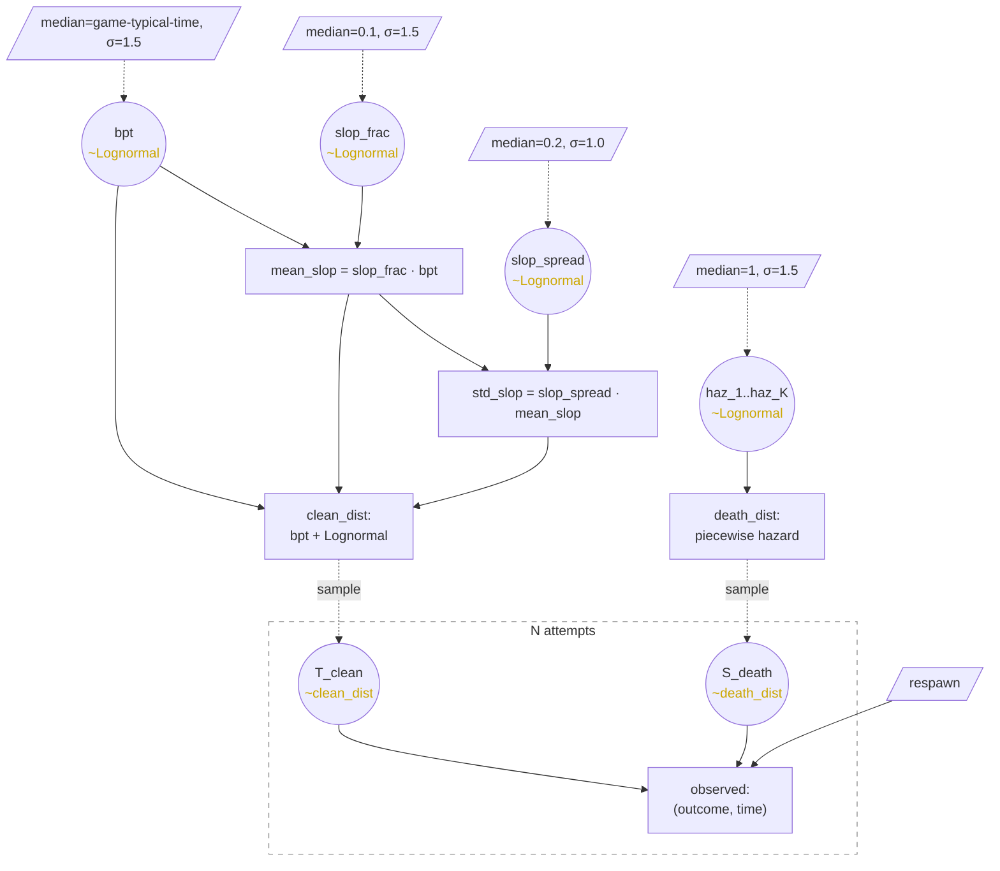

# Speedrun Segment Model — Fixed Skill

> **What this doc is.** The base model — no learning, no hierarchy, no
> hazard alternatives. The conceptual foundation that the rest of the
> system extends. Read this first.
>
> **What's actually implemented.** A V07 reparameterization that adds
> per-attempt learning curves on `slop_frac`, `slop_spread`, and the
> hazard rate `α`. See [learning_curves.md](learning_curves.md). Two
> hazard families are available: `haz1` (K=1 piecewise constant, the
> default) and `beta2` (K=2 beta mixture, opt-in). See
> [reports/2026-05-16_haz1_vs_beta2_findings.md](reports/2026-05-16_haz1_vs_beta2_findings.md)
> for the comparison. Multi-segment hyperpriors landing per
> [segment_model_hyperpriors.md](segment_model_hyperpriors.md).

## The model

A single attempt is generated by two independent rolls and a comparison:

```
T_clean = sample from clean_dist                # would-be clean time (wall-clock)
S_death = sample from death_dist                # would-be death fraction (s-coords)

if S_death > 1:
    return ("survived", T_clean)
else:
    return ("died", S_death · T_clean + respawn)
```

`T_clean` and `S_death` are independent. `S_death` lives in fractional-position s-coordinates, which makes it invariant to skill — `T_clean` simply scales how long it takes to physically traverse the route.

## Components

**clean_dist** = `bpt + Lognormal(μ_log, σ_log)`

Parameters `(μ_log, σ_log)` of the Lognormal are derived from `mean_slop` and `slop_spread` by matching moments:
- `σ_log² = log(1 + slop_spread²)`
- `μ_log = log(mean_slop) − σ_log²/2`

This makes `E[T_clean − bpt] = mean_slop` and `std(T_clean − bpt) = slop_spread · mean_slop` by construction. Since Lognormal ≥ 0, no truncation needed — `T_clean ≥ bpt` automatically.

**death_dist** in s-coords, specified via piecewise-constant `haz(s)` on `[0, 1]`:
- K bins with rates `haz_1, ..., haz_K`. K starts at 1, grows when data justifies a split (heuristic TBD).
- `cum_haz(s) = ∫₀ˢ haz(u) du` — piecewise linear.
- `surv_prob(s) = exp(−cum_haz(s))` — probability the death roll exceeds s.
- `death_density(s) = haz(s) · surv_prob(s)` — density of `S_death` at `s ∈ [0,1]`.
- `P(S_death > 1) = surv_prob(1)` — probability of no death in [0,1].

**respawn** — known game constant.

## Primitives

The actual inferred parameters:

| Primitive     | Meaning                                | Constraint |
|---------------|----------------------------------------|------------|
| `bpt`         | best possible time                     | `> 0`      |
| `slop_frac`   | clean-time excess as fraction of bpt   | `> 0`      |
| `slop_spread` | std/mean of execution noise (CV)       | `> 0`      |
| `haz_k`       | hazard rate in bin k, for k=1..K       | `> 0`      |

Derived from primitives:
- `mean_slop = slop_frac · bpt`
- `std_slop = slop_spread · mean_slop`
- `var_slop = std_slop²`

`slop_frac` and `slop_spread` are the natural shareable quantities across segments (skill-relative-to-difficulty, not absolute time).

3 + K parameters. All have posteriors; nothing is a point estimate.

## Likelihood per attempt

**Survived attempt at time T.** Recipe needs `T_clean = T` and `S_death > 1`. Independent rolls:
```
L_survived(T) = clean_dist(T) · surv_prob(1)
```

**Died attempt at observed wall-clock time t_obs.** Let `τ = t_obs − respawn` (in-attempt time at death). We observe only the product `τ = S_death · T_clean`. Marginalize over the unobserved `T_clean`, with Jacobian `1/T` from the change of variables:

```
L_died(τ) = ∫_{T ≥ bpt}^{∞} clean_dist(T) · haz(τ/T) · surv_prob(τ/T) · (1/T) dT
```

Integrand components:
- `clean_dist(T)` — density of would-be clean time at T
- `haz(τ/T)` — hazard at the implied fractional position `s = τ/T`
- `surv_prob(τ/T)` — probability of surviving in s-coords up to τ/T
- `1/T` — Jacobian from s ↔ wall-clock conversion

No closed form. Evaluated by numerical quadrature (~20–50 points) at each MCMC step. The integrand is sharply peaked near `T ≈ mean_clean` when `var_slop` is small, so few quadrature points suffice.

## Observed data per attempt

- `outcome ∈ {survived, died}`
- if survived: `T` (clean completion time)
- if died: `t_obs` (observed wall-clock, includes respawn)

Not observed: `T_clean` for failed attempts, `S_death` for any attempt, which bin caused a death.

## How a death attributes to bins (under marginalization)

The marginal likelihood for a died attempt at τ is a weighted integral over possible `T_clean` values. For each T in the integrand:
- The implied fractional position is `s = τ/T`, which may fall in different bins for different T
- `haz(τ/T)` pulls the corresponding bin's rate up
- `surv_prob(τ/T)` pulls all earlier bins' rates down (survived through them)
- Each contribution is weighted by `clean_dist(T) · (1/T)`

A death distributes its evidence across the bins that `τ/T` could plausibly fall into, with dominant weight near `τ/mean_clean`. A clean attempt contributes `−cum_haz(1)` in log-likelihood — uniform negative evidence to every bin ("didn't die anywhere").

## Why Lognormal for clean_dist

`T_clean − bpt = Σ_i mistake_i` where per-trick mistakes are positively correlated within an attempt — flow state or nervousness affects every trick. CLT argument fails (it needs independence), and the multiplicative-state model fits better: each run has a "quality factor" multiplying baseline mistakes. Sum of multiplicatively-scaled positive things is approximately Lognormal.

Practically: improvements come together across tricks within an attempt. A good run is good throughout; a bad run is bad throughout. Lognormal captures this; the Normal-via-CLT approximation doesn't.

Caveat: practicing isolated subsections via save states decouples tricks. Lognormal is still approximately right in that case, just less tightly motivated.

Upgrades available if visual checks demand: 2-component mixture for bimodal-route segments where an optional hard trick gives a shortcut (producing two modes); robust-likelihood replacement if outlier attempts wreck the fit.

---

# Extension — Priors

The model above takes the 3 + K primitives as given. To do Bayesian inference we add a prior on each.

All four primitives are strictly positive, single-peaked, and multiplicatively interpretable — `Lognormal` fits all of them. In log-space each prior becomes `Normal(log(median), σ)`, which integrates cleanly with log-space optimization or MCMC and slots into multiplicative learning curves later without reparameterization.

| Primitive     | Prior                                            | Central 68% range  |
|---------------|--------------------------------------------------|--------------------|
| `bpt`         | `Lognormal(median = game-typical-time, σ = 1.5)` | ~0.22m to ~4.5m (m = game-typical-time) |
| `slop_frac`   | `Lognormal(median = 0.1, σ = 1.5)`               | ~0.02 to ~0.45     |
| `slop_spread` | `Lognormal(median = 0.2, σ = 1.0)`               | ~0.07 to ~0.55     |
| `haz_k`       | `Lognormal(median = 1, σ = 1.5)` per bin, i.i.d. | ~0.22 to ~4.5      |

(Central 68% = `exp(μ ± σ)` where `μ = log(median)`.)

Cost of all-Lognormal: no parameter can be exactly zero. A "safe" hazard bin's posterior collapses to a tight blob near zero — indistinguishable from zero for any prediction we'd make. Acceptable trade.

Constants are starting guesses; expect to tune them after seeing real fits.

---

# Diagnostic plots

Each plot supports a "slider" (scrub `N` from 1 to total, refit or interpolate from cached fits) unless noted.

## 1. Posterior densities of primitives

Four panels: `bpt`, `mean_clean`, `std_clean`, per-bin `haz_k`. Prior in light gray for contrast. Posteriors tighten as N grows.

## 2. Clean-time histogram with posterior predictive

Histogram of observed survived times. Predictive density curve (one per posterior sample, or median + band) over the top. Vertical line at posterior median of `bpt`.

*The* core fit check — if predictive shape doesn't match the histogram, the clean-time model is wrong.

## 3. Hazard function `haz(s)` over `s ∈ [0, 1]`

Piecewise-constant step function with 50% / 90% credible bands. Tick marks at plug-in `s* = τ/mean_clean` per death. Bin boundaries faintly visible.

## 4. Survival curve over time-in-attempt

`P(alive at time t into an attempt)`. Monotone-decreasing from 1, with credible bands. Equivalent to `surv_prob(s)` mapped through `t = s · mean_clean` — easier to read in wall-clock time.

## 5. `M_clear` over attempts

X: attempt number. Y: posterior median of expected total wall-clock time to clear from scratch (averaged over retries, including respawns), with 50% / 90% bands.

```
M_clear = (1 − p) / p · (E[S_death | died] · E[T_clean] + respawn) + E[T_clean]
       where p = surv_prob(1)
```

No slider — this plot inherently shows evolution. The headline plot for player-facing intuition.

---

# Inference

**Per attempt**: warm-started MAP via scipy L-BFGS-B with JAX-jitted
value-and-grad. Laplace covariance from `jax.hessian` at MAP. Sub-second
at d ≤ 15 parameters; p50 8 ms / p99 35 ms on streaming refits at
N=500. The original spec called for Nelder-Mead; the V07 JAX rewrite
replaced it (~700× cold-fit speedup). See
[reports/2026-05-16_speed_and_techniques.md](reports/2026-05-16_speed_and_techniques.md).

**Per session (end-of-stream)**: NUTS via NumPyro for the ridge case
and as a Laplace-band oracle. Planned, not yet implemented.

**Per second during an attempt**: don't refit. Update *posterior
predictives* from cached samples — e.g., "expected wall-clock to next
death", "P(survive this attempt)". Cheap, sufficient for live UI.

Quadrature for the died-attempt integral: composite Simpson's rule on
a fixed grid (~50–100 points) over
`[max(bpt, τ), bpt + mean_slop + 8·std_slop]`. The integrand is
single-peaked near `T = bpt + mean_slop`.

Parameterization: work in log-space `θ = log(params)`. Lognormal
priors become Normal on `θ` and positivity is automatic.

---

# Bin placement

Bin edges are a separable choice from the rest of the model. Any function `pick_edges(...) → ndarray` on `[0, 1]` plugs in. Common pickers:

- **Uniform**: equal-width. Simplest, robust default.
- **KDE valleys**: edges at local minima of a Gaussian KDE on observed `s*`. K emerges from the bandwidth.
- **k-means midpoints**: cluster `s*` into K groups; edges at midpoints between consecutive centers.
- **Greedy evidence**: optimize edge positions directly to maximize Laplace evidence.
- **Manual**: override based on game knowledge.

Placement matters: at fixed K, picker choice can swing log-evidence by 10+ nats. Bin placement dominates K choice — equal-width K=2 frequently loses to K=1, while KDE-valleys K=2 with the same data can beat K=1 by 5+ nats.

## Choosing K — evidence-threshold rule

Compare the Laplace approximation to the log marginal likelihood:

```
log p(data | K) ≈ log p(data, θ_MAP | K) + (d/2) log(2π) + (1/2) log|Σ|
                                                          └── Occam term ──┘
```

The volume term `(1/2) log|Σ|` implements the automatic Occam penalty: extra parameters cost evidence unless they earn it back in fit quality. Its strength is determined by the prior width — not a separately tuned knob.

Promotion rule: bump `K → K+1` when `log_evidence(K+1) − log_evidence(K) > δ`. One-way ratchet (K never decreases). `δ ≈ 1` leans toward more bins; `δ ≈ 3` requires "substantial evidence". Only `δ` is a knob beyond the prior.

---

# Status of refinements

Items from the original "future refinements" list, with current status.

- **Learning curves** on `slop_frac`, `slop_spread`, `α` — **done** (V07).
  See [learning_curves.md](learning_curves.md).
- **Beta on `S_death`** as alternative hazard — **done** (beta2, K=2
  mixture). See
  [reports/2026-05-15_beta_mixture_decisions.md](reports/2026-05-15_beta_mixture_decisions.md)
  and the 2x2 comparison in
  [reports/2026-05-16_haz1_vs_beta2_findings.md](reports/2026-05-16_haz1_vs_beta2_findings.md).
- **Hierarchical pooling** — partial. `halflife_sf` pooled via
  empirical Bayes. Expansion to other halflives planned per the v1
  hyperprior scope in
  [segment_model_hyperpriors.md](segment_model_hyperpriors.md).
- **`haz_floor`** (constant background hazard added to piecewise) —
  **explored and rejected**. K-component beta mixture subsumes the
  capacity at lower Occam cost. Details in
  [reports/2026-05-15_beta_mixture_decisions.md](reports/2026-05-15_beta_mixture_decisions.md).
- **Robust likelihood** (Student-t in `clean_dist`) — deferred,
  on-list only if outliers wreck real-data fits.
- **Bimodal `clean_dist`** (2-component mixture for route forks) —
  deferred.
- **Route change-points** (discrete `bpt` shifts) — explicitly
  deferred in current scope. New routes get a new segment name.
- **Smoothness prior on `haz_k`** (random walk in log-space, K=20+
  small bins) — deferred. The beta-mixture path superseded the
  many-bins-with-smoothing approach.
- **Per-attempt shape evolution** (peak disappearance, migration,
  narrowing) — known limitation, not yet modeled. The current model
  assumes shape is static over attempts; real data may force a
  `w_k(n)` or `μ_k(n)` curve. See moving-peaks discussion in
  [reports/2026-05-17_handoff_status.md](reports/2026-05-17_handoff_status.md).

---

# Generative DAG



- **Circles**: stochastic random variables (parameters and per-attempt latents).
- **Boxes**: deterministic quantities (derivations, distributions, observations, constants).
- **Solid arrows**: deterministic dependence. **Dotted arrows**: stochastic draw.
- **Plate**: replicated structure (one copy per attempt).

Top-to-bottom is the generative process: priors → parameters → derived → distributions → per-attempt rolls → observation.
