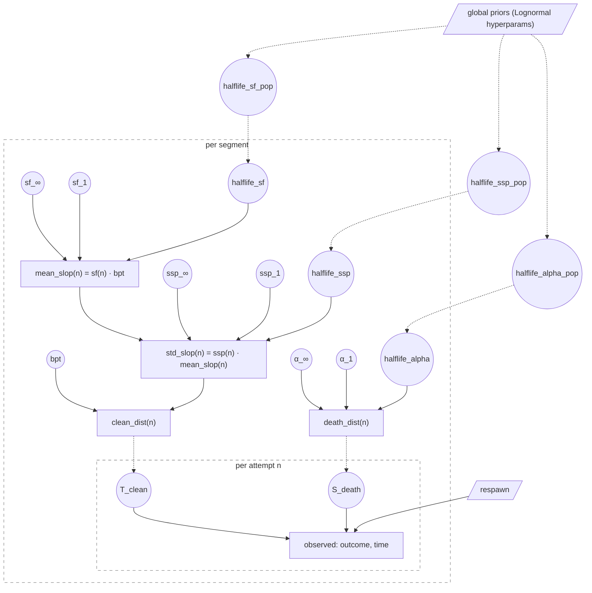

# Hyperprior Extension

Companion to [segment_model.md](segment_model.md) and
[learning_curves.md](learning_curves.md). The single-segment model fits
each segment in isolation with hand-set Lognormal priors on its
primitives. This extension lifts those priors into a hierarchy that
pools information across segments.

## The unifying frame

Each single-segment prior looks like:

```
param ~ Lognormal(median = constant, σ = constant)
```

The extension replaces a constant median with a draw from a higher
Lognormal whose median is learned one level up:

```
param_segment ~ Lognormal(median = param_pop, σ_within)
param_pop     ~ Lognormal(median = hyper_const, σ_between)
```

Per-segment data informs `param_segment`. The collection of segments
informs `param_pop`. Silent (low-N) segments shrink toward `param_pop`;
data-rich segments stay near their own MAP. Standard partial-pooling
behavior — see [pgm_tricks.md](pgm_tricks.md) "Hierarchical models".

## v1 scope — what's pooled

Empirical Bayes (point-estimate the pool, refit segments conditional
on the frozen pool, iterate to convergence). Implemented in
[`fit_eb_pool.py`](../fit_eb_pool.py) for `halflife_sf`. Extending to
other halflives is mechanical — same code shape.

| Latent | Pool status | Reasoning |
|---|---|---|
| `halflife_sf` | **landed** (EB pool, 2026-05-16) | Highest-value pool: ridge-bound at single-segment scale, pools cleanly (player skill is portable across segments) |
| `halflife_ssp` | **planned** (next session work) | Same ridge mechanic as halflife_sf |
| `halflife_alpha` | **planned** | Same |
| `sf_∞`, `ssp_∞`, `α_∞` | deferred | Usually well-identified at moderate N — pool would buy little |
| `sf_1`, `ssp_1`, `α_1` | deferred | Same |
| `bpt` | **never** | Segments have legitimately different theoretical times. Pooling would actively hurt. |

The v1 milestone is "all three halflives pooled." Then the model is
considered complete for SpinLab handoff.

## v1 scope — what's NOT pooled

Explicit deferrals for v1, with the conditions under which we'd
revisit:

- **Game-level + global-level layers** (the full
  global→game→segment hierarchy). Skipped because single-game
  scope collapses the game level. Add when ≥2 games with comparable
  segments exist.
- **`difficulty_game` latent + SMW Central rating observation**.
  Falls out of skipping game-level. A per-game ordinal "how hard is
  this hack" has no per-segment analog and is unidentified at single-
  game scope.
- **Hyperpriors on σs** (promoting between-segment σ from constant
  to latent). Identifiability concern with limited segments; v1 keeps
  σs fixed.

If real data eventually shows multi-segment asymptote ID problems at
low N, we'd revisit asymptote pooling as a v1.5 step.

## Why EB rather than full Bayesian

Full hierarchical NUTS would propagate hyperparameter uncertainty
into per-segment posteriors. EB freezes the hyperparameters as point
estimates, decoupling per-segment fits.

Trade-offs:
- EB scales linearly: S segments → S independent fits per iteration,
  ~5–8 iterations to converge.
- EB underestimates per-segment posterior width by ignoring
  hyperparameter uncertainty. For low N this matters; for moderate-N
  segments the effect is small.
- Full Bayesian is the right move when we eventually want calibrated
  per-segment bands at low N. Goes through the NUTS infrastructure
  planned in
  [reports/2026-05-17_handoff_status.md](reports/2026-05-17_handoff_status.md).

For v1 the EB path is enough.

## DAG (v1)



- Only halflives pool across segments in v1. Asymptotes and
  first-attempt anchors are independent per segment (under broad
  shared priors).
- The beta-shape params (when using beta2) are per-segment static,
  not shown here for clarity. See [learning_curves.md](learning_curves.md).
- σs at each level are fixed in v1.

## Future — the fuller hierarchy

The original hyperprior plan (preserved here for context) called for:

- Three nested levels: global → game → segment.
- All four primitives pooled at each level.
- `difficulty_game` latent + ordinal SMW Central rating observation.
- `diff_coef` global scalar coupling difficulty to hazard.
- Non-centered parameterization at every level (Neal's funnel — see
  [pgm_tricks.md](pgm_tricks.md)) to support NUTS.
- σ promotion to latents in a v2 iteration.

These are valuable upgrades when multi-game scope arrives. None are
on the current critical path; the v1 milestone (halflives only) is
what we hand to SpinLab.
